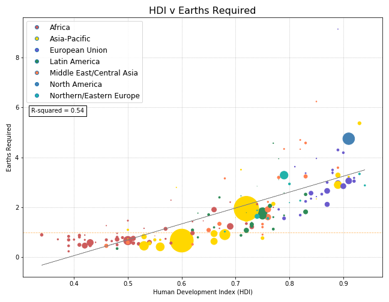

# Project Description
Our team is looking at the overall impact of population and land use on the ecological footprint per region in a global data set.  We are hoping to find correlations from HDI and GDP to overall footprints as well.

# Research Questions
1. What types of land contribute more to ecological footprint? What is the relationship between type of land and total ecological footprint?
2. How much biocapacity is each region using? How does their ecological footprint compare to their biocapacity?
3. What is the relationship between population and ecological footprint?

4. What is the relationship between ecological footprint and Human Development Index (life expectancy, education, and per capita income, etc.)? 

5. Does a higher GDP have a correlation to a lower overall footprint?
6. How does the USA compare to the global average as far as biodeficit?

# Data Set
https://www.kaggle.com/footprintnetwork/ecological-footprint/ 
This data set represents the year 2016.

# Hypothesis:
If developed countries create a higher ecological footprint, 
Then when HDI is 0.7 or higher, the ecological footprint would increase.

# Null: 
If level of development in a country has no effect on ecological footprint, 
Then the ecological footprint would be random across countries.

## Timeline
Initial analysis by Wed 10/16 
Merge ideas & Stats test Thu 10/17- Sat 10/19 
Practice and finalize presentation Sun 10/20 - Wed 10/23 

**Final Presentation Wed 10/23**

# Factoids:
- The U.S. ranks 184 out of 188 countries in size of eco footprint. 
- There are 45 developed countries globally. All of them have Earths Required > 1.0 which means all of them are using more than their share of biocapacity. 
- There are 143 countries (76%) that are still considered “less-developed”. 
51 of them are “developing” and potentially will reach “developed” stage soon.
- There are 129 countries globally (69%) that have Earths Required > 1.0.
